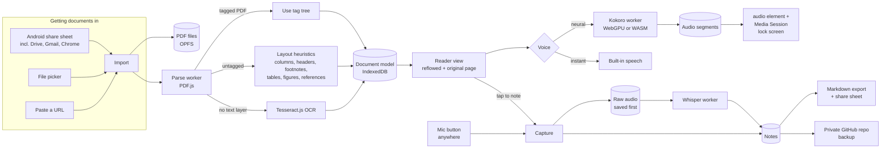

# CitySteps Reader: plan

*Phase 0 output, 2026-09-23. Status: **awaiting Robert's approval.** No application code is written until this is approved.*

## 1. What we are building

A phone app (installable PWA on GitHub Pages) with two jobs:

1. **Read and listen.** Take in any PDF, turn it into clean text in the right order, and read it aloud, including with the screen locked on the GO train.
2. **Capture ideas.** Record or type a thought, tie it to the passage that sparked it, and file it as an Idea, Post start, Article start or Research thread.

It is the phone successor to **CitySteps Studio** (the desktop writing and podcast tool). It carries over Studio's read-aloud design, notes library, reading preferences and wayfinding look, but it does not need the PC to run.

## 2. Constraints set by Robert (2026-09-23)

| Question | Answer | Effect on the design |
|---|---|---|
| Phone | Samsung Galaxy S23, Android, Chrome | No iOS workarounds needed. WebGPU is available. Share sheet works. |
| Cloud budget | **$0, on-device only** | No Claude parsing, no cloud TTS or STT. Everything runs on the phone. See section 8 for what money would buy later. |
| Where notes live | App, backed up to a **private GitHub repo** | Markdown files in a private repo, which can also be opened as an Obsidian vault. |
| Day-one import | **CitySteps Studio notes library** | Studio needs a one-button "Export all notes" (small change there), then import here as Post starts. |
| Offline | **Cached documents and capture work offline** | Parsed documents, saved audio and recording work with no signal. Model downloads and backup wait for a connection. |

## 3. What Phase 0 found

### 3.1 The old tool (CitySteps Studio)

Studio is a FastAPI service on the RTX 4070 plus one 1,600-line HTML file. It is not a git repo.

| Reusable almost as-is (browser code) | Must be replaced (needed the PC's GPU) | Desktop only (left behind) |
|---|---|---|
| Sentence splitting (`collectReadSentences`), sentence and word highlight (CSS Custom Highlight API), proportional word timing (`startWordFollow`), prefetch-next-sentence playback, persistent reader bar | Kokoro voice (`/tts`) becomes on-device Kokoro | Launchers, Chrome app window, audio enhance chain (DeepFilterNet, ClearVoice), ffmpeg conversion |
| Notes library model, autosave, quick switcher, Markdown export (`htmlToMd`) | Live Whisper dictation (`/ws/transcribe`) becomes record-then-transcribe on-device | Podcast record mode and teleprompter |
| Reading and display panel (size, spacing, tint), line focus, focus mode | Obsidian folder export becomes GitHub backup and share sheet | GPU status readout |
| Design tokens: paper `#FEFDF8`, ink `#1B1B18`, signal yellow `#FFD400`, butter `#FBF3C0`; bundled fonts (Bricolage Grotesque, Hanken Grotesk, JetBrains Mono) | | |

What Robert relied on: Kokoro voices (Heart, Bella, Michael, Adam, Emma, George) at 0.9x for proofreading, reading from the paragraph at the caret, a reader bar that stays open, and the word cursor. Known Studio bug to avoid repeating: British voices were run through the American pronunciation pipeline.

### 3.2 Robert's GitHub Pages conventions (from Hok Gong, Wordhoard, Coilover)

- Repo `RobertWalterJ/<name>`, public, Pages served from `main` `/docs`, no GitHub Actions.
- `app/` is hand-written source (plain ES modules). `build/make-deploy.mjs` writes `docs/`, stamps the service-worker version with the git hash, and fails on absolute URLs (the site lives under a sub-path).
- `npm run check` runs every gate (verify, colour audit, dyslexia audit, behaviour tests) before `npm run build`. esbuild is the only dev dependency.
- Service worker: every cache name carries the app prefix (all apps share the `robertwalterj.github.io` origin), network-first for pages, cache-first for heavy assets, and an "A new version is ready" bar.
- `speech.js` with `unlock()` on first `pointerdown` (mobile will not speak until a user gesture), and voice scoring that prefers local en-CA/en-GB voices.
- Commit messages: `vX.Y.Z, plain summary`. Tests open with a comment quoting the complaint that caused them.
- **Departure:** sibling apps store everything in `localStorage`. This app stores PDFs, audio and models, so it needs IndexedDB and OPFS (details in DECISIONS.md, D4).

### 3.3 PDF.js spike (Tier 1, on-device)

`spikes/pdfjs-tier1-spike.mjs` ran pdfjs-dist 6.3.289 over eight real PDFs from Robert's machine (listed in `test-fixtures/README.md`).

| Check | Result |
|---|---|
| Two-column journal pages | **Works** after one fix. Grouping text into lines first merged the two columns (the Stark paper read across the gutter). Finding the gutter from individual text items first, then refusing to merge across it, fixed it: Stark 7/9 pages found as two-column (page 1 correctly single-column), Post-studentification 11/12. Reading order then correct. |
| Running headers and footers | **Works.** Repeated top and bottom lines found on the journals ("Landmarks \| Stark") and on the browser-printed Globe article (date, title and URL on every page). |
| Hyphenated line breaks | **Works** ("harm-less", "neighbour-hood" rejoined). |
| Scan with no text layer | **Detected** (0 text items). Routes to OCR. |
| Tables | **Fails, as expected.** The Toronto inclusionary zoning scan, a full-page table, reads as word salad. Tables must be detected and shown as cards, never read as prose. |
| Tagged PDFs | None of the eight were tagged. PDF.js exposes the tag tree (`getStructTree`) when present, so tagged City reports get the author's own reading order for free. |
| Not yet tested | A print newspaper page (multi-article), a 60+ page staff report with maps, a multi-page scan. **Robert to supply.** |

### 3.4 Facts verified today that change the brief

1. **Android Chrome cannot record audio and use Web Speech recognition at the same time** (recognition returns nothing while a MediaRecorder holds the mic), and its `continuous` mode has no effect. So "save the audio first, transcribe second" means on-device Whisper, not the built-in recognizer.
2. **Built-in speech (`speechSynthesis`) gives no word-boundary events on Android** and stops when the screen locks. It stays as the instant fallback voice only. Word highlighting uses Studio's own proportional timing, which never depended on boundary events.
3. **Lock-screen playback needs a real `<audio>` element with the Media Session API**, fed continuous segments of at least 5 seconds. So the neural voice must render audio files, which suits Kokoro.
4. **kokoro-js (1.2.1) has not been updated since May 2025** and pins an old Transformers.js. The alternative is **sherpa-onnx** (Apache-2.0, updated Sept 2026), which runs Kokoro, Piper and Kitten voices in WASM. Both get tried on the S23.
5. **Transformers.js 4.3.0 has a WebGPU Whisper bug**; pin 4.2.0.
6. **The Android share sheet can send PDFs straight into an installed PWA** (`share_target`). This also covers Google Drive: share from the Drive app, no Google sign-in needed.
7. **Parser licences have loosened.** Marker's code is now Apache-2.0 and MinerU is no longer AGPL. Docling remains MIT. All are clean for personal use if a desktop batch step is ever wanted.

## 4. Architecture



Everything runs in the browser on the phone. Heavy work (PDF parsing, Kokoro, Whisper, OCR) runs in Web Workers so the page never freezes. Models download once, on Wi-Fi, into a cache the service worker never evicts.

## 5. Stack

| Layer | Choice | Why (full reasoning in DECISIONS.md) |
|---|---|---|
| App shell | Plain ES modules, esbuild, `app/` to `docs/`, Pages from `main /docs` | Matches Hok Gong exactly |
| PDF text | pdfjs-dist 6.3.x in a worker (about 0.5 MB gzipped) | Proven in the spike |
| Layout | Own heuristics, extended from the spike; evaluate LiteParse's browser build first | Spike already gets columns and headers right; LiteParse may save the table and figure work |
| OCR | Tesseract.js (English), downloaded on first scan | Free, offline |
| Neural voice | Kokoro 82M, 8-bit (about 86 MB), via sherpa-onnx or kokoro-js, whichever is faster on the S23 | Same voices Robert chose in Studio |
| Instant voice | Built-in `speechSynthesis` with the Wordhoard `unlock()` pattern | Zero download, works immediately |
| Transcription | Whisper base (about 77 MB) by default, small (about 249 MB) optional, via Transformers.js 4.2.0 | Accurate enough for notes; runs after recording |
| Storage | IndexedDB (documents, notes, audio) + OPFS (PDFs, models), `navigator.storage.persist()` | Too big for `localStorage` |
| Backup | GitHub Contents API, fine-grained token for one private repo only | $0, versioned, Obsidian-readable |
| Look | Studio's wayfinding tokens and bundled fonts; CitySteps branding, never GPA | Continuity with Studio |

## 6. Data model

```
Doc       { id, title, authors[], year, publisher, docType: academic|report|news|whitepaper|other,
            source: { kind: share|file|url, name, url? }, pdfPath (OPFS), pageCount,
            parse: { method: tagged|heuristic|ocr, version, status, warnings[] },
            tags[], progress: { blockId, offset, updatedAt }, addedAt }
Section   { id, docId, title, level, firstBlockId }
Block     { id, docId, seq, page, sectionId,
            kind: heading|abstract|para|quote|list|caption|figure|table|footnote|reference|boilerplate,
            text, bbox: { page, x, y, w, h },
            readByDefault: boolean,            // false for footnote, reference, table, boilerplate
            cropPath?  }                       // page-image crop for figure and table cards
AudioSeg  { docId, voice, speed, fromBlock, toBlock, blobKey, durationSec, wordTimes[] }
Note      { id, type: idea|post|article|thread, title, body (Markdown), tags[],
            anchors: [{ docId, blockId, quote, page }],
            recordings: [{ blobKey, durationSec, transcript: { status, raw, clean, engine } }],
            createdAt, updatedAt }
Queue     { id: 'commute', docIds[] }
Settings  { voice per docType, speed per docType, skip flags, reading prefs (ported from Studio) }
```

Parsing is keyed by a hash of the PDF bytes plus the parser version, so a document is parsed once and re-parsed only when the parser improves.

## 7. Phases

Each phase ends with something usable on the S23, deployed to Pages.

**Phase 0.5: Device spikes (first thing after approval, about a day).** One throwaway test page on Pages that measures, on the S23: Kokoro speed (sherpa-onnx vs kokoro-js, WebGPU vs WASM), Whisper base and small speed, whether `<audio>` + Media Session keeps playing with the screen locked across segment changes, and whether a recording survives the app going to the background. Results fill the comparison table in section 9 and settle the default voice engine.

**Phase 1: Reader MVP.** Installable app shell, share-sheet and file import, Tier 1 parsing (tag tree, columns, headers and footers, page numbers, hyphenation, references section, footnotes), reflowed reader with section navigator, original-page toggle, built-in voice with Studio's highlighting, resume position, skip-references and skip-footnotes switches.

**Phase 2: Capture.** Mic button everywhere (pauses playback, records, resumes), audio saved in 5-second chunks so nothing is lost if Android kills the app, Whisper transcription queue, the four note types, passage anchors, writing view (ported from Studio's editor, trimmed for touch), Markdown export with citations, GitHub backup, and the Studio notes import.

**Phase 3: Hard documents, on-device.** Table and figure detection shown as cards (page-image crop plus caption, read aloud only on request), Tesseract OCR for scans, multi-article separation for newspaper pages, and a **"fix the order" mode**: tap blocks to skip or reorder them, saved per document. This mode is the honest safety net for layouts the heuristics get wrong, in place of the cloud tier.

**Phase 4: Listening quality.** Kokoro voices, "prepare for the commute" (render a whole document to audio ahead of time, on the charger), lock-screen controls, commute queue, voice and speed per document type.

**Phase 5: Polish.** Full-text search across documents and notes, skim mode (abstract, headings, conclusions), 100+ page performance, URL import, storage manager, anything left from Studio.

## 8. Cost

**At Robert's chosen setting: $0 per month.** Hosting on GitHub Pages and the private backup repo are free. All models are open-licence downloads (about 86 MB voice, 77 MB transcription, about 15 MB OCR, once each).

For later reference, if the ceiling ever rises (prices verified 2026-09-23):

| Would buy | Service | At Robert's likely usage | Monthly |
|---|---|---|---|
| Clean parsing of newspapers, scans and tables | Claude Sonnet 5 with PDF input (about 4K tokens a page) | 3 hard documents a week, 30 pages each | about $3 |
| Faster, more accurate transcription | Groq Whisper large-v3-turbo | 15 minutes of dictation a day | under $0.50 |
| Studio-grade voices without phone rendering | Google Chirp 3 HD (1M characters a month free) | about 10 hours of listening | $0 to $5 |

None of these would need a proxy: Anthropic, OpenAI, Groq and Google all accept direct browser calls with a key kept on the phone.

A second free option exists: CitySteps Studio's Kokoro and Whisper already run on the 4070 at home. If Tailscale is ever allowed on that laptop, the phone could hand big jobs to the PC. It stays out of scope until then.

## 9. TTS and STT comparison (to be measured on the S23 in Phase 0.5)

| Option | Download | Speed on S23 | Quality | Lock screen | Offline |
|---|---|---|---|---|---|
| Built-in `speechSynthesis` (Google voices) | 0 | instant | fair | **no** | yes if voice installed |
| Kokoro 8-bit, sherpa-onnx WASM | about 86 MB | *to measure* | very good | yes (rendered audio) | yes |
| Kokoro, kokoro-js WebGPU | 86 to 325 MB | *to measure* | very good | yes | yes |
| Piper or Kitten (fallback voice) | 25 to 60 MB | *to measure* | good | yes | yes |
| Whisper base, Transformers.js | about 77 MB | *to measure* | good | n/a | yes |
| Whisper small | about 249 MB | *to measure* | very good | n/a | yes |
| Moonshine base | about 63 MB | *to measure* | good, English only | n/a | yes |
| Web Speech recognition | 0 | live | good | n/a | **no** (Google servers), and cannot record at the same time |

Rule for the defaults: a voice must render at least twice as fast as it speaks to be the default for live listening. Anything slower is used only for "prepare for the commute".

## 10. Risks

| Risk | Likelihood | Mitigation |
|---|---|---|
| Kokoro too slow on the S23 for live listening | Medium | Pre-render for commutes; built-in voice for live; smaller Kitten voice |
| Android pauses the page when locked, breaking segment hand-off | Medium | One long-lived `<audio>` fed by MediaSource or long segments; battery "unrestricted" hint during setup; tested in Phase 0.5 |
| Android stops the mic when the app is backgrounded | Medium | 5-second chunks written as they arrive; nothing lost, and the note shows it was cut short. Tested in Phase 0.5 |
| Newspaper and complex report layouts beat the heuristics | High | Cards for tables and figures, original-page toggle, and "fix the order" mode. Paid parsing stays available as a later switch |
| Storage evicted | Low (installed PWA) | `persist()`, GitHub backup of notes, PDFs re-importable from source |
| GitHub token on the phone | Low | Fine-grained token limited to one private repo and to file contents only; can be revoked in one click |
| Copyrighted test PDFs leaking into the public repo | Low | Fixtures gitignored; tests commit only structure counts and hashes, never text |

## 11. Asks of Robert

1. **Approve this plan** (or redirect it). On approval, Phase 0.5 starts.
2. **Three more test PDFs** when convenient: a print newspaper or magazine page, a long Toronto staff report with maps, a multi-page scan.
3. **Repo name.** Proposed: `RobertWalterJ/citysteps-reader`, served at `robertwalterj.github.io/citysteps-reader/`. Nothing has been pushed.
